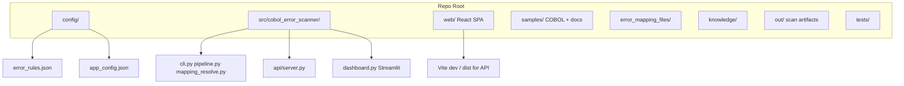
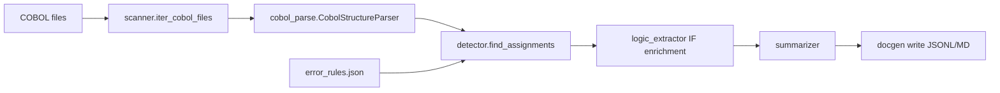

# Legacy Error Code Mapper — Technical Summary

One-page reference for architects and developers: purpose, stack, architecture, dual scanning paths, outputs, UIs, and extension points. For day-to-day onboarding commands, see [CODEBASE_ONBOARDING.md](CODEBASE_ONBOARDING.md).

---

## What It Is

**Legacy Error Code Mapper** (package name: `cobol-error-logic-scanner`) is a Python tool for **COBOL impact analysis** and **legacy modernization**. It scans folders of COBOL sources (`.cbl`, `.cob`, `.cpy`), finds where error/return codes are assigned, ties them to nearby **IF / END-IF** logic and message literals, and produces **searchable artifacts** for architects and migration teams.

It is explicitly a **practical subset** of full COBOL analysis — not a compiler front end — designed to be extended via config, mapping files, and optional LLM summarization.

---

## Technology Stack

### Backend (Python 3.10+)

| Layer | Technology |
| ----- | ---------- |
| CLI | Typer + Rich |
| COBOL parsing | Lark (`CobolStructureParser`) |
| Data models | Pydantic v2 |
| Data processing | Pandas |
| Classic UI | Streamlit (port **8504**) |
| Enterprise API | FastAPI + Uvicorn (port **8000**) |
| Optional LLM | OpenAI API or local Ollama |
| Optional doc ingest | pypdf, python-docx, openpyxl, beautifulsoup4 (`[documents]` extra) |

### Frontend (Enterprise UI)

| Layer | Technology |
| ----- | ---------- |
| Framework | React 18 + TypeScript |
| Build | Vite 8 (dev port **5173**, proxies `/api` → 8000) |
| Routing | React Router |
| Diagrams | Mermaid (flowcharts) |

### Storage

**No database.** All data is file-based:

- Scan outputs in [`out/`](../out)
- CORORA/CORORL mappings in [`error_mapping_files/`](../error_mapping_files)
- Analyst feedback and ingest in [`knowledge/`](../knowledge)

---

## Repository Layout



**Key paths:**

- Package source: [`src/cobol_error_scanner/`](../src/cobol_error_scanner)
- Scan rules: [`config/error_rules.json`](../config/error_rules.json)
- App settings: [`config/app_config.json`](../config/app_config.json)
- Developer onboarding: [CODEBASE_ONBOARDING.md](CODEBASE_ONBOARDING.md)
- Entry points defined in [`pyproject.toml`](../pyproject.toml)

---

## Core Architecture — Two Scanning Paths

The mapper has **two complementary detection mechanisms**:

### Path 1: Standard Config-Driven Scan

Used for full scans and when error codes appear as **literal assignments** in source.



**How it works:**

1. **File scanner** — Recursively discovers `.cbl`, `.cob`, `.cpy` ([`scanner.py`](../src/cobol_error_scanner/scanner.py))
2. **Structure pass** — Normalizes fixed-format lines; locates PROCEDURE DIVISION, sections, paragraphs ([`cobol_parse.py`](../src/cobol_error_scanner/cobol_parse.py))
3. **Error detector** — Finds `MOVE`/`SET` into configured fields and regex pattern matches ([`detector.py`](../src/cobol_error_scanner/detector.py))
4. **Logic extractor** — Walks backward through IF/END-IF nesting; attaches conditions, parameters, and message literals ([`logic_extractor.py`](../src/cobol_error_scanner/logic_extractor.py))
5. **Summarizer** — Heuristic row summaries; optional OpenAI/Ollama for program-level narrative ([`summarizer.py`](../src/cobol_error_scanner/summarizer.py))
6. **Report writer** — Emits JSONL, manifest, markdown tables ([`docgen.py`](../src/cobol_error_scanner/docgen.py))

**Config fields** in [`config/error_rules.json`](../config/error_rules.json):

- `return_code_fields` — numeric status targets (e.g. `SQLCODE`, `RETURN-CODE`)
- `error_code_fields` — alphanumeric error code targets (e.g. `ERROR-CODE`)
- `error_message_fields` — message text targets (e.g. `ERROR-MSG`)
- `error_patterns` — named regex rules (e.g. `STOP RUN`, `SQLCODE NOT = ZERO`)
- `code_length` — length filter (default **2** chars)

### Path 2: CORORA/CORORL Legacy Mapping

Used when filtering by **two-character codes** (`-e`) or **88-level condition names** (`-f`), especially for `E*` codes that do not appear as direct literals.

**Mapping input files** ([`error_mapping_files/`](../error_mapping_files)):

| File | Maps |
| ---- | ---- |
| `CORORA_TWO_CHAR_ERROR.txt` | 2-char `VALUE` → `CORORA-R-*` 88-level names |
| `CORORL_TWO_CHAR_ERROR.txt` | Same for CORORL family |
| `CORORA_ONE_CHAR_ERROR.txt` | 1-char `VALUE` → `CORORA-R-ERROR-*` |
| `CORORL_ONE_CHAR_ERROR.txt` | Same for CORORL |

Example mapping line: `88 CORORA-R-ERROR-DOM-TO-INTL-BI VALUE 'X5'.`

**Core modules:**

- [`mapping_catalog.py`](../src/cobol_error_scanner/mapping_catalog.py) — Parses copybook fragments; builds value→name indexes
- [`mapping_resolve.py`](../src/cobol_error_scanner/mapping_resolve.py) — Resolves codes to COBOL occurrences via pattern search

**Resolution algorithm** (`resolve_mapped_error_code`):

1. **Non-`E` codes** (e.g. `X5`, `C0`): Look up literal in both two-char files → collect 88-level names → scan sources for `SET <name> TO TRUE`
2. **`E` prefix codes** (e.g. `E5`): Map second char via one-char files → search `SET … TO TRUE` → fallback via INV-TRANSIT-MODE branch → final fallback via `MOVE '<2nd>' TO …-R-ERROR-TYPE`
3. **Field query** (`-f ERR-NO-SEC-…`): Substring match on 88-level names → derive codes → resolve each

---

## Data Models

Defined in [`models.py`](../src/cobol_error_scanner/models.py) (Pydantic):

| Model | Purpose |
| ----- | ------- |
| `SourceLocation` | File path, line, column |
| `VariableRef` | Data name, role, line |
| `ErrorOccurrence` | Code, field, condition, `mapping_detail`, `logic_context` |
| `ProgramSummary` | Program ID, occurrences, plain-English summary |
| `ScanManifest` | Full scan metadata; `to_searchable_records()` → flat JSONL rows |

Ingestion/knowledge models in [`ingestion/models.py`](../src/cobol_error_scanner/ingestion/models.py).

---

## Entry Points and Interfaces

### Console Scripts ([`pyproject.toml`](../pyproject.toml))

| Script | Purpose |
| ------ | ------- |
| `cobol-scan` | Primary CLI — full scan, `-e` code filter, `-f` field filter |
| `cobol-ingest` | Ingest operational docs; link to findings; suggest resolutions |
| `cobol-dashboard` | Streamlit Classic UI |
| `cobol-dashboard-api` | FastAPI + built React SPA |
| `cobol-flowchart` | Generate Mermaid/DOT from findings |

### Key CLI Flags

```powershell
cobol-scan <SOURCE_ROOT> [-r rules.json] [-o out/] [-e CODE] [-f FIELD] [--corora-mappings DIR] [--summarizer heuristic|openai|ollama]
```

### FastAPI Endpoints ([`api/server.py`](../src/cobol_error_scanner/api/server.py))

| Endpoint | Purpose |
| -------- | ------- |
| `POST /api/scan` | Run scan with code/field filters |
| `GET /api/findings` | Paginated, filterable findings |
| `GET /api/findings/{index}` | Single finding detail |
| `GET /api/flowchart` | Mermaid chart for a finding |
| `POST /api/ingest` | Document ingest |
| `POST /api/findings/{index}/confirmed-resolution` | Save analyst feedback |
| `GET /api/export/csv` | CSV export |

---

## Outputs and Persistence

### Scan Artifacts (default: `out/`)

| File | Content |
| ---- | ------- |
| `errors.jsonl` | One JSON row per finding (searchable) |
| `manifest.json` | Full `ScanManifest` |
| `errors_table.md` | Full scan markdown table |
| `error_table.md` | Filtered by `-e` |
| `error_field_table.md` | Filtered by `-f` |

### Knowledge Store (`knowledge/`)

Managed by [`ingestion/knowledge_store.py`](../src/cobol_error_scanner/ingestion/knowledge_store.py):

- `documents.jsonl` — Ingested operational docs
- `resolutions.jsonl` — Resolution suggestions
- `confirmed_resolutions.jsonl` — Analyst-confirmed fixes
- `code_field_index.json` — Error code ↔ field cross-index
- `user_fixes.jsonl`, `evidence_feedback.jsonl` — User feedback

---

## User Interfaces

### Classic UI (Streamlit)

- Launch: `cobol-dashboard` → `http://localhost:8504`
- Metrics, filters, finding details, Mermaid flowcharts (CDN)

### Enterprise UI (React + FastAPI)

**Development** (two terminals):

```powershell
cobol-dashboard-api          # API at http://127.0.0.1:8000
cd web && npm run dev        # Vite at http://localhost:5173
```

**Production** (single process):

```powershell
cd web && npm run build
cobol-dashboard-api          # Serves API + built SPA at http://127.0.0.1:8000
```

---

## Optional Features

1. **LLM summarization** — OpenAI (`OPENAI_API_KEY`) or Ollama (`OLLAMA_BASE_URL`, `OLLAMA_MODEL`); falls back to heuristics on failure
2. **Document ingestion** — Runbooks, tickets, PDFs, emails linked to COBOL findings via entity extraction
3. **Resolution suggestions** — Heuristic or LLM-based, informed by code + operational docs
4. **Analyst feedback loop** — Confirmed resolutions and accepted evidence persist in `knowledge/`
5. **Flowchart generation** — Mermaid/DOT from row summaries for visual review

---

## Environment Variables

| Variable | Default | Purpose |
| -------- | ------- | ------- |
| `COBOL_APP_CONFIG` | `config/app_config.json` | Override app config |
| `COBOL_OUT_DIR` | `out/` | API output directory |
| `COBOL_API_HOST` / `COBOL_API_PORT` | `127.0.0.1` / `8000` | Enterprise API bind |
| `COBOL_WEB_DIST` | `web/dist` | Built React assets |
| `OPENAI_API_KEY` | — | OpenAI summarizer/resolver |
| `OLLAMA_BASE_URL` / `OLLAMA_MODEL` | `localhost:11434` / `llama3.2` | Local LLM |

---

## Extension Points

- **Field lists and regex rules** — Edit [`config/error_rules.json`](../config/error_rules.json)
- **CORORA/CORORL mappings** — Add/update files in [`error_mapping_files/`](../error_mapping_files) or pass `--corora-mappings`
- **Resolver provider** — Set `resolver.provider` in [`config/app_config.json`](../config/app_config.json) (`heuristic`, `openai`, `ollama`)
- **Custom summarizer** — `--summarizer` flag or UI setting
- **Tests** — pytest files in [`tests/`](../tests)

---

## Quick Start

```powershell
cd Legacy-Error-Code-Mapper-ver1
py -m pip install -e .

# Full scan
py -m cobol_error_scanner.cli samples -r config\error_rules.json -o out

# Filter by legacy code
py -m cobol_error_scanner.cli samples -e X5 -o out

# Filter by 88-level field name
py -m cobol_error_scanner.cli samples -f ERR-NO-SEC-EDD-OVRD -o out

# Classic dashboard
cobol-dashboard
```

---

## Summary in One Sentence

The Legacy Error Code Mapper is a **Python + React** toolchain that **scans COBOL sources** for error-code assignments, **enriches findings with IF-block context**, optionally **resolves legacy CORORA/CORORL two-character codes** via copybook mappings, and exposes results through **CLI artifacts**, a **Streamlit dashboard**, and an **Enterprise FastAPI/React UI** with optional **LLM summarization** and **operational document linking**.
